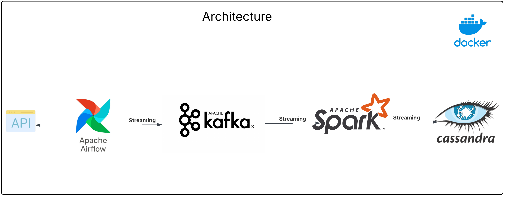

## Project Overview

This project demonstrates a data streaming pipeline using Apache Kafka, Apache Spark, and Cassandra. The pipeline streams user data from an external API (https://randomuser.me/api/) into a Kafka topic, processes the data using Spark, and stores it in a Cassandra database.

## Architecture
1. **Airflow DAG (dags/kafka_stream.py):**
   - Orchestrates the data streaming process.
   - Fetches user data from an external API (randomuser.me).
   - Formats the data and streams it to a Kafka topic.  
2. **Spark Streaming (spark_stream.py):**
   - Reads data from the Kafka topic.
   - Processes the data using Spark.
   - Writes the data into a Cassandra table.
3. **Docker Compose (docker-compose.yml):**
    - Sets up the required services: Kafka, Zookeeper, Spark, Cassandra, and Airflow.

## Cassandra Schema
* Keyspace: `spark_streams`
* Table: `created_users`
* Schema:
  - UUID `id` PRIMARY KEY
  - TEXT `first_name`
  - TEXT `last_name`
  - TEXT `email`
  - TEXT `gender`
  - TEXT `post_code`
  - TEXT `username`
  - TEXT `dob`
  - TEXT `phone`
  - TEXT `registered_date`
  - TEXT `picture`
